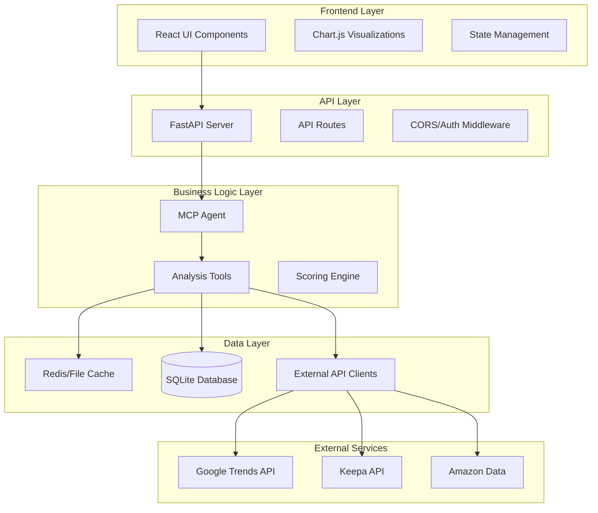

# KDP Strategist Functional Implementation - Design Document

## Overview

This design document outlines the technical approach to transform the KDP Strategist application from its current partially implemented state into a fully functional system. The design focuses on addressing critical gaps while maintaining the existing architecture's strengths.

## Architecture

### Current State Analysis

The application currently has:
- ✅ Well-designed FastAPI backend structure
- ✅ React frontend with proper component organization
- ✅ MCP agent framework implementation
- ✅ Comprehensive data models and type definitions
- ❌ Incomplete tool implementations with mock data
- ❌ Non-functional API client integrations
- ❌ Missing persistence layer
- ❌ Import/dependency resolution issues

### Target Architecture



## Components and Interfaces

### 1. API Client Layer

#### Google Trends Client
```python
class TrendsClient:
    def __init__(self, config: TrendsConfig, cache_manager: CacheManager):
        self.pytrends = TrendReq(hl='en-US', tz=360)
        self.cache = cache_manager
        self.rate_limiter = RateLimiter(calls=30, period=60)
    
    async def get_trend_analysis(self, keyword: str, timeframe: str) -> TrendAnalysis:
        # Implementation with real pytrends integration
        pass
    
    async def get_related_queries(self, keyword: str) -> List[str]:
        # Implementation with caching and error handling
        pass
```

#### Keepa Client
```python
class KeepaClient:
    def __init__(self, config: KeepaConfig, cache_manager: CacheManager):
        self.api_key = config.api_key
        self.session = aiohttp.ClientSession()
        self.cache = cache_manager
        self.rate_limiter = RateLimiter(calls=100, period=60)
    
    async def get_product_data(self, asin: str) -> ProductData:
        # Implementation with real Keepa API or graceful fallback
        pass
    
    async def search_products(self, keyword: str, limit: int = 20) -> List[ProductData]:
        # Implementation with proper error handling
        pass
```

### 2. Database Layer

#### Schema Design
```sql
-- Analysis Results Storage
CREATE TABLE niche_analyses (
    id INTEGER PRIMARY KEY AUTOINCREMENT,
    keyword VARCHAR(255) NOT NULL,
    analysis_data JSON NOT NULL,
    created_at TIMESTAMP DEFAULT CURRENT_TIMESTAMP,
    expires_at TIMESTAMP,
    INDEX idx_keyword (keyword),
    INDEX idx_created_at (created_at)
);

-- API Response Cache
CREATE TABLE api_cache (
    cache_key VARCHAR(255) PRIMARY KEY,
    response_data JSON NOT NULL,
    created_at TIMESTAMP DEFAULT CURRENT_TIMESTAMP,
    expires_at TIMESTAMP NOT NULL,
    INDEX idx_expires_at (expires_at)
);

-- User Sessions and Preferences
CREATE TABLE user_sessions (
    session_id VARCHAR(255) PRIMARY KEY,
    preferences JSON,
    created_at TIMESTAMP DEFAULT CURRENT_TIMESTAMP,
    last_accessed TIMESTAMP DEFAULT CURRENT_TIMESTAMP
);
```

#### Database Manager
```python
class DatabaseManager:
    def __init__(self, db_path: str = "kdp_strategist.db"):
        self.db_path = db_path
        self.connection_pool = None
    
    async def initialize(self):
        # Create tables and indexes
        pass
    
    async def store_analysis(self, analysis: NicheAnalysis) -> str:
        # Store analysis results with expiration
        pass
    
    async def get_cached_analysis(self, cache_key: str) -> Optional[NicheAnalysis]:
        # Retrieve cached analysis if not expired
        pass
```

### 3. Enhanced Tool Implementations

#### Niche Discovery Tool
```python
async def find_profitable_niches(
    trends_client: TrendsClient,
    keepa_client: Optional[KeepaClient],
    cache_manager: CacheManager,
    db_manager: DatabaseManager,
    base_keywords: List[str],
    **kwargs
) -> Dict[str, Any]:
    
    # 1. Check cache for recent analysis
    cache_key = generate_cache_key(base_keywords, kwargs)
    cached_result = await db_manager.get_cached_analysis(cache_key)
    if cached_result and not cached_result.is_expired():
        return cached_result.to_dict()
    
    # 2. Expand keywords using real trend data
    expanded_keywords = await expand_keywords_with_trends(
        trends_client, base_keywords
    )
    
    # 3. Analyze trends for expanded keywords
    trend_analyses = await batch_analyze_trends(
        trends_client, expanded_keywords
    )
    
    # 4. Analyze competition using available data sources
    competition_data = await analyze_competition_multi_source(
        keepa_client, expanded_keywords
    )
    
    # 5. Generate and score niche candidates
    niche_candidates = generate_niche_candidates(
        trend_analyses, competition_data
    )
    
    # 6. Store results and return
    analysis = NicheAnalysis(
        keywords=base_keywords,
        niches=niche_candidates,
        metadata=generate_metadata()
    )
    await db_manager.store_analysis(analysis)
    
    return analysis.to_dict()
```

### 4. Error Handling and Resilience

#### Circuit Breaker Pattern
```python
class CircuitBreaker:
    def __init__(self, failure_threshold: int = 5, timeout: int = 60):
        self.failure_threshold = failure_threshold
        self.timeout = timeout
        self.failure_count = 0
        self.last_failure_time = None
        self.state = "CLOSED"  # CLOSED, OPEN, HALF_OPEN
    
    async def call(self, func, *args, **kwargs):
        if self.state == "OPEN":
            if time.time() - self.last_failure_time > self.timeout:
                self.state = "HALF_OPEN"
            else:
                raise CircuitBreakerOpenError()
        
        try:
            result = await func(*args, **kwargs)
            if self.state == "HALF_OPEN":
                self.state = "CLOSED"
                self.failure_count = 0
            return result
        except Exception as e:
            self.failure_count += 1
            self.last_failure_time = time.time()
            
            if self.failure_count >= self.failure_threshold:
                self.state = "OPEN"
            
            raise e
```

#### Graceful Degradation
```python
class GracefulDegradationManager:
    def __init__(self):
        self.service_status = {
            "google_trends": True,
            "keepa_api": True,
            "database": True
        }
    
    async def execute_with_fallback(self, primary_func, fallback_func, service_name):
        if not self.service_status[service_name]:
            logger.warning(f"Service {service_name} is down, using fallback")
            return await fallback_func()
        
        try:
            return await primary_func()
        except Exception as e:
            logger.error(f"Service {service_name} failed: {e}")
            self.service_status[service_name] = False
            return await fallback_func()
```

## Data Models

### Enhanced Niche Model
```python
@dataclass
class Niche:
    # Core identification
    category: str
    primary_keyword: str
    subcategory: str = ""
    keywords: List[str] = field(default_factory=list)
    
    # Numeric scores (0-100 scale)
    competition_score_numeric: float = 0.0
    profitability_score_numeric: float = 0.0
    market_size_score: float = 0.0
    confidence_score: float = 0.0
    
    # Categorical levels (derived from numeric scores)
    competition_level: CompetitionLevel = CompetitionLevel.MEDIUM
    profitability_tier: ProfitabilityTier = ProfitabilityTier.MEDIUM
    
    # Analysis data
    trend_analysis_data: Optional[TrendAnalysis] = None
    competitor_analysis_data: Dict[str, Any] = field(default_factory=dict)
    seasonal_factors: Dict[str, float] = field(default_factory=dict)
    content_gaps: List[str] = field(default_factory=list)
    
    # Metadata
    analysis_date: datetime = field(default_factory=datetime.now)
    data_sources: List[str] = field(default_factory=list)
    confidence_indicators: Dict[str, float] = field(default_factory=dict)
    
    def __post_init__(self):
        # Auto-assign categorical levels based on numeric scores
        if self.competition_score_numeric > 0:
            self.competition_level = self._determine_competition_level(
                self.competition_score_numeric
            )
        if self.profitability_score_numeric > 0:
            self.profitability_tier = self._determine_profitability_tier(
                self.profitability_score_numeric
            )
```

### Analysis Result Model
```python
@dataclass
class NicheAnalysis:
    id: str = field(default_factory=lambda: str(uuid.uuid4()))
    keywords: List[str] = field(default_factory=list)
    niches: List[Niche] = field(default_factory=list)
    metadata: AnalysisMetadata = field(default_factory=AnalysisMetadata)
    created_at: datetime = field(default_factory=datetime.now)
    expires_at: Optional[datetime] = None
    
    def is_expired(self) -> bool:
        if not self.expires_at:
            return False
        return datetime.now() > self.expires_at
    
    def to_dict(self) -> Dict[str, Any]:
        return {
            "id": self.id,
            "keywords": self.keywords,
            "niches": [niche.to_dict() for niche in self.niches],
            "metadata": self.metadata.to_dict(),
            "created_at": self.created_at.isoformat(),
            "expires_at": self.expires_at.isoformat() if self.expires_at else None
        }
```

## Error Handling

### Error Classification
```python
class KDPStrategistError(Exception):
    """Base exception for KDP Strategist application"""
    pass

class APIClientError(KDPStrategistError):
    """Errors related to external API clients"""
    pass

class DataValidationError(KDPStrategistError):
    """Errors related to data validation"""
    pass

class ConfigurationError(KDPStrategistError):
    """Errors related to application configuration"""
    pass

class RateLimitExceededError(APIClientError):
    """Rate limit exceeded for external API"""
    def __init__(self, service: str, retry_after: int):
        self.service = service
        self.retry_after = retry_after
        super().__init__(f"Rate limit exceeded for {service}. Retry after {retry_after} seconds.")
```

### Global Error Handler
```python
@app.exception_handler(KDPStrategistError)
async def kdp_strategist_exception_handler(request: Request, exc: KDPStrategistError):
    logger.error(f"KDP Strategist error: {exc}")
    
    if isinstance(exc, RateLimitExceededError):
        return JSONResponse(
            status_code=429,
            content={
                "error": "rate_limit_exceeded",
                "message": str(exc),
                "retry_after": exc.retry_after,
                "service": exc.service
            }
        )
    
    return JSONResponse(
        status_code=500,
        content={
            "error": "internal_error",
            "message": "An internal error occurred. Please try again later."
        }
    )
```

## Testing Strategy

### Unit Testing
- Test individual components in isolation
- Mock external API dependencies
- Validate data model serialization/deserialization
- Test error handling scenarios

### Integration Testing
- Test API client integrations with real services
- Validate database operations
- Test end-to-end analysis workflows
- Verify caching behavior

### Performance Testing
- Load testing for concurrent users
- API response time validation
- Memory usage monitoring
- Cache hit rate optimization

### Mock Data Strategy
```python
class MockDataProvider:
    @staticmethod
    def get_mock_trend_data(keyword: str) -> TrendAnalysis:
        # Provide realistic mock data for testing
        return TrendAnalysis(
            keyword=keyword,
            trend_score=random.uniform(30, 90),
            direction=random.choice(list(TrendDirection)),
            # ... other realistic mock data
        )
    
    @staticmethod
    def get_mock_competition_data(keyword: str) -> Dict[str, Any]:
        # Provide realistic mock competition data
        return {
            "competitor_count": random.randint(5, 100),
            "avg_price": random.uniform(5.99, 29.99),
            # ... other realistic mock data
        }
```

This design provides a comprehensive approach to transforming the KDP Strategist application into a fully functional system while maintaining its architectural strengths and addressing the identified gaps.